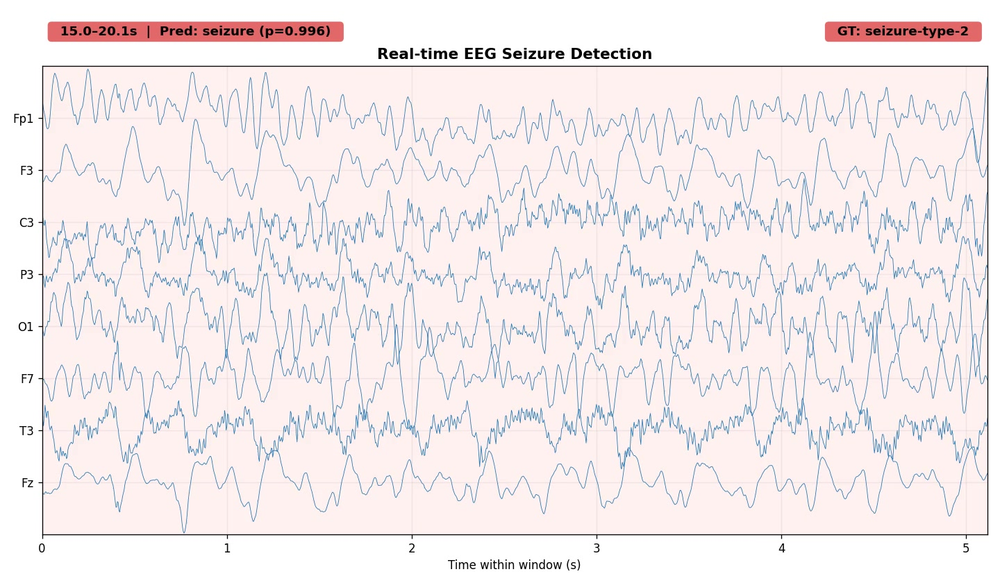

# Diff-EEG

A diffusion-based EEG foundation model for seizure detection and seizure subtype classification.

## Real-Time EEG Seizure Detection Demo

[](https://lauedu74602-my.sharepoint.com/:v:/g/personal/abedelkader_helwan_lau_edu_lb/IQCgcsNPtvqxQaqW0qzuG7H3AVjM_D_OXHeGq0VOvGOxLw0?nav=eyJyZWZlcnJhbEluZm8iOnsicmVmZXJyYWxBcHAiOiJPbmVEcml2ZUZvckJ1c2luZXNzIiwicmVmZXJyYWxBcHBQbGF0Zm9ybSI6IldlYiIsInJlZmVycmFsTW9kZSI6InZpZXciLCJyZWZlcnJhbFZpZXciOiJNeUZpbGVzTGlua0NvcHkifX0&e=LbSSnz)

> **Click the image above to watch the real-time seizure detection demo**

---

## Pre-trained Models

| Model | Task | Dataset | Download |
|-------|------|---------|----------|
| `best_EEGDIFF2.pth` | Diffusion backbone (pre-training) | THUSZ | [Download](https://lauedu74602-my.sharepoint.com/:u:/g/personal/abedelkader_helwan_lau_edu_lb/IQCvOrCk3Us8Sry9uUmBYtChAfJxYRlFvrFMA3Emr6fE8Wo?e=uszLoB) |
| `best_classifier.pth` | Binary seizure detection (patient-wise) | THUSZ | [Download](https://lauedu74602-my.sharepoint.com/:u:/g/personal/abedelkader_helwan_lau_edu_lb/IQCvOrCk3Us8Sry9uUmBYtChAfJxYRlFvrFMA3Emr6fE8Wo?e=uszLoB) |
| `best_top4_subtype.pth` | Subtype classification (segment-wise, top-4 subtypes) | THUSZ | [Download](https://lauedu74602-my.sharepoint.com/:u:/g/personal/abedelkader_helwan_lau_edu_lb/IQBXX6hTMhavQIYtks90HObsAVOBkX5oWSqmRB2M7y8tYpY?e=L4DjP6) |
| `kall_unfrozen_best.pth` | Binary detection (normal vs abnormal) | TUAB | [Download](https://lauedu74602-my.sharepoint.com/:u:/g/personal/abedelkader_helwan_lau_edu_lb/IQD16KHZFE-ITrMuAe5pGmzaAZdQq-pQ0JSt27KP5lrV8zk?e=Jk29JF) |

---

## Quick Start: Fine-tuning the Pre-trained Model

### 1. Requirements

```bash
pip install torch numpy scikit-learn tqdm matplotlib einops
```

### 2. Download the pre-trained checkpoint

Download `best_EEGDIFF2.pth` from OneDrive and place it in the project root:

> **[Download Pre-trained Model](https://lauedu74602-my.sharepoint.com/:u:/g/personal/abedelkader_helwan_lau_edu_lb/IQCvOrCk3Us8Sry9uUmBYtChAfJxYRlFvrFMA3Emr6fE8Wo?e=uszLoB)**

### 3. Load the backbone

```python
import torch
from Diff_EEG_train import DeepEnhancedEEGDiffusionModel

# Architecture config (must match pre-trained checkpoint)
ARCH = dict(
    in_channels=22,
    model_channels=32,
    channel_multipliers=[1, 2, 4, 8],
    num_res_blocks=2,
    time_emb_dim=512,
    dropout=0.1,
    attention_heads=8
)

device = torch.device("cuda" if torch.cuda.is_available() else "cpu")

# Initialize and load weights
backbone = DeepEnhancedEEGDiffusionModel(**ARCH).to(device)
ckpt = torch.load("best_EEGDIFF2.pth", map_location=device)
backbone.load_state_dict(ckpt['model_state_dict'])
backbone.eval()
print(f"Loaded model: {sum(p.numel() for p in backbone.parameters()):,} parameters")
```

### 4. Freeze backbone and add a classifier head

```python
import torch.nn as nn

# Freeze all backbone parameters
for p in backbone.parameters():
    p.requires_grad = False

# Optionally unfreeze last few layers for fine-tuning
if hasattr(backbone, 'bottleneck_blocks'):
    for block in backbone.bottleneck_blocks[-2:]:
        for p in block.parameters():
            p.requires_grad = True

if hasattr(backbone, 'down_blocks'):
    for module_list in backbone.down_blocks[-2:]:
        for block in module_list:
            for p in block.parameters():
                p.requires_grad = True

# Add classification head (example: binary seizure detection)
num_classes = 2  # change for your task
feature_dim = ARCH['model_channels'] * sum(ARCH['channel_multipliers']) * 5  # multi-scale features

classifier = nn.Sequential(
    nn.Linear(feature_dim, 512),
    nn.BatchNorm1d(512),
    nn.GELU(),
    nn.Dropout(0.4),
    nn.Linear(512, 256),
    nn.BatchNorm1d(256),
    nn.GELU(),
    nn.Dropout(0.2),
    nn.Linear(256, num_classes),
).to(device)
```

### 5. Extract features and train

```python
# Input: EEG tensor of shape (batch, 22, 1280) — 22 channels, 5 sec @ 256 Hz
# Probe at multiple diffusion timesteps for multi-scale features
probe_timesteps = [50, 250, 500, 750, 950]
pool = nn.AdaptiveAvgPool1d(1).to(device)

def extract_features(x):
    """Extract multi-scale features from backbone at multiple timesteps."""
    B = x.shape[0]
    all_feats = []
    for t_val in probe_timesteps:
        t = torch.full((B,), t_val, dtype=torch.long, device=device)
        t_emb = backbone.time_mlp(t)
        h = backbone.init_conv(x)
        level_outputs = []
        for module_list in backbone.down_blocks:
            if len(module_list) == 1 and isinstance(module_list[0], nn.Conv1d):
                h = module_list[0](h)
            else:
                for block in module_list:
                    if hasattr(block, 'forward') and 'time_emb' in block.forward.__code__.co_varnames:
                        h = block(h, t_emb)
                    else:
                        h = block(h)
                level_outputs.append(pool(h).squeeze(-1))
        all_feats.append(torch.cat(level_outputs, dim=1))
    return torch.cat(all_feats, dim=1)

# Training loop
optimizer = torch.optim.AdamW(classifier.parameters(), lr=5e-4, weight_decay=1e-4)
loss_fn = nn.CrossEntropyLoss()

for epoch in range(100):
    for x_batch, y_batch in train_loader:  # your DataLoader
        x_batch, y_batch = x_batch.to(device), y_batch.to(device)
        features = extract_features(x_batch)
        logits = classifier(features)
        loss = loss_fn(logits, y_batch)
        optimizer.zero_grad()
        loss.backward()
        optimizer.step()
```

### 6. Full fine-tuning examples

See the evaluation scripts for complete working examples:

| Task | Script | Description |
|------|--------|-------------|
| Binary seizure detection (THUSZ) | `evaluation/binary_seizure_detection/patientwise_binary_classification.py` | Patient-wise split with RL-assisted decision |
| Seizure subtype classification | `evaluation/subtype_classification/patient_wise_cv/patientwise_cv_classification.py` | 5-fold patient-wise CV, 4 subtypes |
| TUAB normal vs abnormal | `evaluation/tuab_binary_detection/finetune_tuab_rl.py` | Fine-tune + eval on TUAB dataset |

---

## Repository Structure

```
├── Diff_EEG_train.py                  # Pre-training script (diffusion backbone)
├── training_history.json              # Pre-training metrics
├── training_progress.png              # Pre-training curves
├── output.mp4                         # Real-time inference demo
└── evaluation/
    ├── binary_seizure_detection/
    │   └── patientwise_binary_classification.py
    ├── subtype_classification/
    │   ├── segment_wise_stratified/   # Stratified 80/20 split
    │   ├── segment_wise_fewshot/      # Few-shot (frozen vs unfrozen)
    │   └── patient_wise_cv/           # 5-fold patient-wise CV
    └── tuab_binary_detection/
        ├── finetune_tuab_rl.py        # Fine-tune on TUAB
        ├── eval_tuab.py               # Evaluate on TUAB test set
        └── results.out                # Evaluation results
```